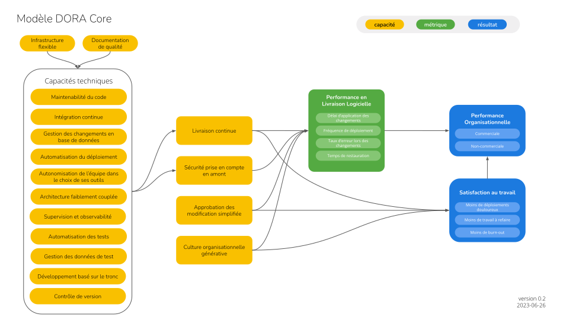

> Le noyau de DORA est un travail en cours. Pour en savoir plus et faire part de vos commentaires, consultez la [Discussion GitHub sur le noyau de DORA](https://github.com/dora-team/dora.dev/discussions/265).

# Le noyau de DORA
Le programme de recherche DORA est continu et permanent ; chaque année apporte de nouvelles pistes de recherche, et chaque analyse apporte de nouvelles perspectives. À la pointe de la connaissance, de nouveaux concepts sont fréquemment introduits, et des artefacts (en particulier les [Rapports Accelerate sur l’État du DevOps]() sont continuellement publiés, révélant de nouvelles perspectives et de nouvelles dynamiques. Avec chaque étude, certaines conclusions antérieures sont renforcées, tandis que d'autres peuvent être remises en question. Il s'agit là d'une caractéristique propre à la bonne science : toute nouvelle découverte doit être considérée comme suspecte - intrigante, mais suspecte - tant qu'elle n'a pas été validée par la reproduction et la mise en application. Entre-temps, les praticiens sont encouragés à utiliser les résultats de la recherche dans leur propre contexte professionnel. Dans ces contextes, il peut être difficile de suivre les derniers développements de DORA : les efforts de transformation culturelle dans une grande organisation requièrent une approche constante, persistante sur des périodes de temps s'étalant sur plusieurs années. Une tentative d'actualisation des pratiques pour suivre le rythme de la recherche peut conduire à des changements contre-productifs. Dans ce contexte, il est plus pratique de s'appuyer sur des artefacts "évolutifs". Le noyau de DORA représente une distillation des résultats les plus fondamentaux de DORA : les mesures, les capacités et les résultats que la recherche a mis en évidence de manière répétée. Il permet aux équipes de concentrer leurs efforts d'amélioration de manière encore plus précise sur ce qui est susceptible de produire des avantages tangibles pour leurs objectifs organisationnels et leur qualité de vie. 

> [Download as PDF](dora-core-model.fr.pdf)

## FAQ (FOIRE AUX QUESTIONS)
#### Qu'y a-t-il dans le noyau ? Qu'est-ce qui ne l'est pas ?
Le noyau de DORA englobe l'ensemble des entités qui ont été étudiées de façon permanente par DORA et dont les interactions sont bien supportées. Ces entités comprennent des capacités telles que la [livraison continue] () et la [culture organisationnelle générative] (), des mesures telles que les "quatre mesures clés", et des résultats tels que la performance organisationnelle. Ces idées établies contrastent avec les domaines de recherche, ou les voies prédictives divergentes, qui se sont révélées prometteuses lorsque nous les avons étudiées, mais qui ne sont pas (encore) aussi bien étayées dans le cadre du modèle prédictif de DORA. Une entité peut être considérée comme essentielle si : a) elle a fait l'objet d'au moins deux recherches ; b) les praticiens l'ont jugée utile ; c) la poursuite de l'exploration est justifiée. Cette rubrique est, de par sa conception, subjective et se fonde en grande partie sur les données et les analyses, mais elle est en fin de compte guidée par l'intuition. N'hésitez donc pas à apporter votre contribution ! Votre intuition est précieuse ; si vous avez l'impression que quelque chose ne reflète pas fidèlement la recherche, n'hésitez pas à nous le faire savoir.

#### Le noyau changera-t-il un jour ?
Oui ! L'application de la recherche est nécessairement moins volatile que la recherche elle-même. Mais elle n'est pas statique. Le noyau évoluera au fil du temps, et les éléments que nous commençons à étudier aujourd'hui seront, une fois établis, "gradués" dans le noyau. Un seuil de soutien est requis pour l'inclusion dans le noyau ; de même, si des preuves suffisantes sont recueillies pour soutenir la suppression ou la modification d'un élément du noyau, celui-ci sera déprécié. Le noyau est informé par la recherche et évolue avec elle, mais plus lentement.

#### Qu'est-ce que le modèle de base ?
Le modèle de base de DORA est un résumé visuel du cadre prédictif que DORA a développé depuis sa création. Il s'inspire de tous les modèles d'équations structurelles (SEM) qui ont été développés au fil des ans, afin de mettre en évidence les entités et les voies prédictives les mieux étayées. Les praticiens sont encouragés à étudier le modèle et à l'utiliser pour guider leur parcours d'amélioration continue.

#### Toutes les années de recherche sont-elles traitées de la même manière ?
Non. Certains résultats se sont avérés extrêmement durables, se répétant année après année. Mais, comme on peut s'y attendre lorsqu'on étudie un contexte dynamique, d'autres résultats ont changé. De plus, chaque année, nous ajoutons ou supprimons des domaines d'étude. Notre objectif avec Core est de créer quelque chose de durable à travers les années, tout en évoluant au fur et à mesure que nous continuons à apprendre. À cette fin, les recherches les plus récentes ont plus de poids que les plus anciennes. C'est pourquoi, par exemple, "Shift Left on Security" est séparé des capacités techniques, ce qui reflète les résultats de 2021 et 2022 qui ont montré l'impact unique des pratiques de sécurité sur les performances de livraison des logiciels.
