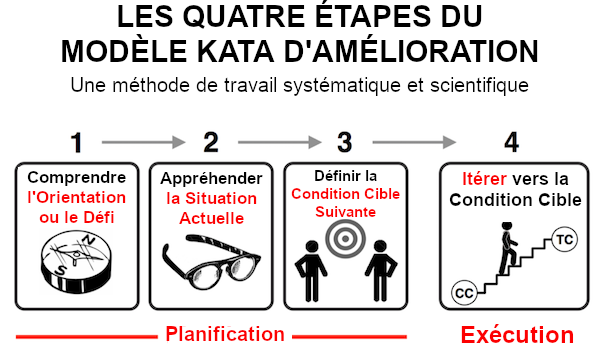
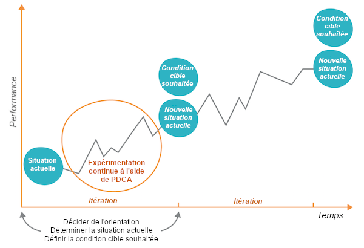
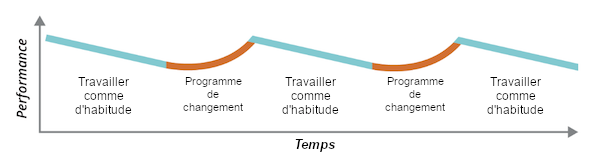

Chaque organisation est en constante évolution. Il convient donc de se poser les questions suivantes :

- Quelle est la direction de ce changement ?
- Quels sont les résultats que vous recherchez au niveau du système ?
- L'organisation est-elle mieux à même de découvrir et de servir ses clients, et donc d'atteindre son objectif ?
- Le modèle d'entreprise de l'organisation et la gestion de son personnel assurent-ils une viabilité à long terme ?

Lorsque les choses semblent ne pas aller comme prévu, il est courant que les dirigeants lancent un programme de transformation. Cependant, ces programmes échouent souvent à atteindre leurs objectifs, consommant de grandes quantités de ressources et de capacités organisationnelles.
Ce document examine la manière de mener à bien une transformation et aborde certaines sources d'échec courantes.

## Comment mettre en œuvre la transformation

Il existe deux ingrédients clés pour une transformation efficace et continue : les processus de mise en œuvre du changement organisationnel en fixant des objectifs tout en permettant à l'équipe d'expérimenter, et les mécanismes de diffusion des bonnes pratiques dans l'ensemble de l'organisation.

### Fixer des objectifs et permettre à l'équipe d'expérimenter

Il existe de nombreux cadres permettant d'exécuter et de mesurer les changements organisationnels, tels que le [tableau de bord prospectif](https://wikipedia.org/wiki/Balanced_scorecard), les [objectifs et résultats clés (OKR)](https://rework.withgoogle.com/guides/set-goals-with-okrs/steps/introduction/), le [kata d'amélioration](http://www-personal.umich.edu/~mrother/The_Improvement_Kata.html) et le [kata de coaching](http://www-personal.umich.edu/~mrother/The_Coaching_Kata.html).
Ces cadres peuvent sembler différents, mais ils partagent tous des caractéristiques essentielles. La dynamique de base est illustrée dans la figure suivante, qui est basée sur le cadre du kata d'amélioration :

Source : Reproduit avec l'autorisation de Mike Rother, à partir de [*Guide de pratique du Kata Toyota : Pratiquer les compétences de la pensée scientifique pour des résultats supérieurs en 20 minutes par jour*](https://www.mheducation.com/highered/product/toyota-kata-practice-guide-practicing-scientific-thinking-skills-superior-results-20-minutes-day-rother/9781259861024.html) par Mike Rother (McGraw-Hill 2018).

Tous les modèles commencent par une direction (un "vrai nord") au niveau de l'organisation ou de la division. Il s'agit d'une aspiration, d'un objectif commercial au niveau du système fixé par le [leadership](/devops-capabilities/cultural/transformational-leadership).
Il peut s'agir d'un idéal impossible à atteindre, tel que le zéro blessure (l'[objectif](https://hbswk.hbs.edu/archive/paul-o-neill-values-into-action) choisi par le PDG d'Alcoa, Paul O'Neill). Il peut aussi s'agir d'un objectif difficile à atteindre dans un délai d'un à trois ans, comme une productivité décuplée (l'[objectif](https://continuousdelivery.com/evidence-case-studies/#the-hp-futuresmart-case-study) choisi par Gary Gruver, lorsqu'il était directeur de l'ingénierie de la division des microprogrammes LaserJet de HP).

L'étape suivante consiste à comprendre la situation actuelle. Le [contrôle rapide DORA](/quickcheck/) peut vous aider à comprendre votre situation en termes de capacités de développement de logiciels et de résultats. Une autre méthode d'analyse consiste à effectuer des exercices tels que la [cartographie de la chaîne de valeur](https://www.google.com/books/edition/Value_Stream_Mapping_How_to_Visualize_Wo/MeFrAAAAQBAJ) ou la comptabilité des activités. Il s'agit de comprendre où en est l'organisation en termes mesurables.

La troisième étape consiste à fixer des objectifs mesurables pour une date ultérieure. Ces objectifs peuvent être décrits à l'aide d'un format tel que les OKR, qui commencent par un objectif qualitatif et spécifient ensuite des résultats clés mesurables (conditions cibles). Par exemple, le DSI de HSBC pour la banque et les marchés mondiaux [a fixé à chaque équipe comme objectif](https://www.linkedin.com/pulse/double-half-quarter-lesson-from-book-richard-david-knott/) de "doubler, diviser par deux et diviser par quatre chaque année : doubler la fréquence des publications, diviser par deux le nombre d'incidents à faible impact et diviser par quatre le nombre d'incidents à fort impact".

Enfin, les équipes expérimentent des moyens d'atteindre ces objectifs jusqu'à ce que la date future soit atteinte, avec le soutien de la direction. Les équipes adoptent une approche scientifique de l'expérimentation, en utilisant la [méthode PDCA](https://wikipedia.org/wiki/PDCA) (Plan-Do-Check-Act), également connue sous le nom de cycle de Deming. Le cycle se compose des étapes suivantes : 

- Plan (Planifier) : déterminer le résultat attendu.
- Do (Faire) : réaliser l'expérience.
- Check (Vérifier) : étudier les résultats.
- Act (Agir) : décider de ce qu'il faut faire ensuite.

Les équipes doivent mener des expériences quotidiennes pour tenter de se rapprocher des conditions cibles ou des résultats clés. Dans le [kata d'amélioration](http://www-personal.umich.edu/~mrother/The_Improvement_Kata.html), chaque membre de l'équipe doit se poser les cinq questions suivantes chaque jour :

1.  Quelle est la condition cible ?
2.  Quelle est la situation actuelle ?
3.  Quels sont les obstacles qui, selon vous, vous empêchent d'atteindre la condition cible ? Quel est celui auquel vous vous attaquez actuellement ?
4.  Quelle est votre prochaine étape ? Quel résultat attendez-vous ?
5.  Quand les résultats pourront-ils être évalués afin de déterminer les enseignements à tirer de cette étape ?

Lorsque les résultats ont été enregistrés et que de nouveaux objectifs ont été fixés, répétez le processus.

Étant donné que le processus se déroule dans des conditions d'incertitude, il n'est pas toujours évident de savoir comment les résultats seront atteints. Par conséquent, la progression est souvent non linéaire, comme le montre le diagramme suivant :

Source : CC-BY : [*Lean Enterprise : Comment les organisations à haute performance innovent à l'échelle*](https://www.google.com/books/edition/Lean_Enterprise/G_ixBQAAQBAJ) par Jez Humble, Joanne Molesky et Barry O'Reilly (O'Reilly, 2014).

Lors des réunions de planification, les participants examinent les conditions cibles ou les principaux résultats qui ont été fixés lors de la dernière réunion de planification. Ils fixent ensuite de nouveaux objectifs pour la prochaine itération. Lors des séances de revue, les participants examinent dans quelle mesure les équipes atteignent les objectifs de l'itération et discutent des obstacles éventuels et de la manière dont ils seront abordés.

Voici quelques points importants concernant ce modèle :

- Les conditions cibles d'une équipe ou [OKRs](https://rework.withgoogle.com/guides/set-goals-with-okrs/steps/introduction/) doivent être fixées par l'équipe elle-même. S'ils sont fixés de manière descendante, les équipes n'auront pas d'intérêt dans le résultat et ne s'investiront donc pas autant pour les atteindre.
  Au lieu de cela, l'équipe risque de "jouer" avec ces objectifs, c'est-à-dire de manipuler le résultat pour atteindre l'objectif de manière artificielle.
- Il est acceptable de ne pas parvenir à atteindre les objectifs ; certains d'entre eux sont des "objectifs ambitieux", c'est-à-dire qu'ils sont délibérément conçus pour être difficiles à atteindre. Les équipes doivent s'attendre à atteindre environ 80 % des objectifs. Il est courant, au début d'une transformation culturelle, de n'atteindre *aucun* des objectifs spécifiés. Dans ce cas, l'équipe doit fixer un seul objectif pour la prochaine itération et tout mettre en œuvre pour l'atteindre.
- De nombreux objectifs et indicateurs changeront d'une itération à l'autre, en fonction de l'évolution des objectifs de l'équipe et des conditions actuelles, ainsi que de l'apprentissage qu’elle en tirera en travaillant à la réalisation de ses objectifs. Ne passez pas trop de temps à essayer de fixer des objectifs parfaits : concentrez-vous sur l'exécution du processus afin de pouvoir commencer à apprendre.
- Il est important que les équipes disposent de l'autonomie, de la capacité, des ressources, de la gestion et du [soutien du management](/devops-capabilities/cultural/transformational-leadership) nécessaires pour mener à bien le travail d'amélioration. Les équipes ne doivent pas laisser le travail de livraison habituel supplanter le travail d'amélioration, car c'est le travail d'amélioration qui permettra de remédier aux inefficacités qui ralentissent la livraison des produits et des services.

### Créer des structures communautaires pour diffuser les connaissances

Une fois que les équipes ont découvert de meilleures méthodes de travail, la tâche suivante consiste à diffuser les leçons apprises dans l'ensemble de l'organisation. Il existe de nombreuses façons d'y parvenir. Dans le [Rapport 2019 sur l'état de DevOps](https://cloud.google.com/devops/state-of-devops), les chercheurs ont demandé aux personnes interrogées de partager comment leurs équipes et organisations diffusaient les méthodes DevOps et Agile en choisissant une ou plusieurs des approches suivantes (voir l'annexe B du Rapport 2019 sur l'état de DevOps pour des descriptions détaillées) :

- Centre de formation (parfois appelé *dojo*).
- Centre d'excellence (CoE)
- Preuve de concept (PoC) mais décrochage
- Preuve de concept sous forme de modèle
- Preuve de concept sous forme de germe
- Communautés de pratique
- Big bang
- Bottom-up ou terrain
- Mashup

L'analyse montre que les entreprises les plus performantes privilégient les stratégies qui créent des structures communautaires à tous les niveaux de l'organisation, ce qui les rend probablement plus durables et plus résistantes aux réorganisations et aux changements de produits. Les deux stratégies les plus utilisées sont les communautés de pratique et la communauté de terrain, suivies par la preuve de concept sous forme de modèle (un modèle dans lequel la preuve de concept est reproduite ailleurs dans l'organisation), et la preuve de concept sous forme de germe. Pour un exemple de fonctionnement d'une [communauté de pratique](https://www.youtube.com/watch?v=S4-huVFeQXg), [lisez comment la culture de Google en matière de tests unitaires complets a été impulsée par un groupe de volontaires](https://martinfowler.com/articles/testing-culture.html#google).

Les entreprises les moins performantes ont tendance à privilégier les centres de formation et les centres d'excellence : des stratégies qui créent davantage de silos et d'expertise isolée. Ils tentent également des démonstrations de concept, mais celles-ci sont généralement bloquées et n'aboutissent pas. Pourquoi ces stratégies ne parviennent-elles pas à produire des changements efficaces ?

En centralisant l'expertise au sein d'un seul groupe, les centres d'excellence créent plusieurs problèmes. Tout d'abord, le centre d'excellence est désormais un goulot d'étranglement pour l'expertise pertinente de l'organisation et il ne peut pas s'adapter à l'augmentation de la demande d'expertise au sein de l'organisation. Deuxièmement, il crée un groupe exclusif d'"experts" au sein de l'organisation, contrairement à un groupe inclusif de pairs qui peuvent continuer à apprendre et à se développer ensemble. Cette exclusivité peut nuire à une culture organisationnelle saine. Enfin, les experts ne sont plus en mesure d'effectuer leur travail.
Ils sont en mesure de formuler des recommandations ou d'établir de "meilleures pratiques" génériques, mais le passage de l'apprentissage générique à la mise en œuvre d'un travail réel est laissé à la charge des apprenants. Par exemple, les experts organiseront un atelier sur la manière de conteneuriser une application, mais ils ne conteneuriseront que rarement, voire jamais, des applications. Ce décalage entre la théorie et la pratique finira par menacer leur expertise.

Si certains voient le succès des centres de formation, ceux-ci nécessitent des ressources et des programmes dédiés pour mettre en œuvre à la fois le programme initial et l'apprentissage continu. De nombreuses entreprises ont mis en place des ressources considérables pour rendre leurs programmes de formation efficaces : Elles disposent de bâtiments entiers consacrés à un environnement distinct et créatif, et d'un personnel chargé de créer des supports de formation et d'évaluer les progrès réalisés. Des ressources supplémentaires sont alors nécessaires pour garantir que l'apprentissage est maintenu et propagé dans l'ensemble de l'organisation. L'organisation doit apporter son soutien aux équipes qui ont participé au centre de formation, afin de s'assurer que leurs compétences et leurs habitudes sont maintenues dans leur environnement de travail habituel et que les anciens modèles de travail ne sont pas repris. Si ces ressources ne sont pas en place, les organisations risquent de gaspiller tous leurs investissements. Au lieu d'un centre où les équipes se rendent pour apprendre de nouvelles technologies et de nouveaux processus à diffuser dans le reste de l'organisation, les nouvelles habitudes restent dans le centre, créant un autre silo, même s'il est temporaire. Il existe également des limites similaires à celles du centre d'excellence : Si seul le personnel du centre de formation (ou d'autres "experts" détachés) crée des ateliers et du matériel de formation, que se passe-t-il s'il ne fait jamais le travail ?

Les mashups ont été fréquemment mentionnés (40 % des répondants à l'enquête de 2019 ont utilisé cette stratégie), mais ils ne bénéficient pas de financements et de ressources suffisants dans le cadre d'un investissement particulier. Sans stratégie pour guider une transformation technologique, les organisations feront souvent l'erreur de couvrir leurs paris et souffriront de la *mort par initiative* : identifier des initiatives dans un trop grand nombre de domaines, ce qui conduit finalement à sous-financer des travaux importants et à les vouer tous à l'échec. Il est préférable de sélectionner quelques initiatives et de consacrer des ressources permanentes à leur réussite (temps, argent, parrainage par les dirigeants et les praticiens champions). Contrairement aux mashups, très peu de personnes déclarent avoir eu recours à une stratégie "big bang", bien qu'elle soit plus fréquente chez les entreprises peu performantes. 

Une analyse complémentaire a permis d'identifier quatre modèles utilisés par les entreprises les plus performantes :

- **Créateurs de communautés:** Ce groupe se concentre sur les communautés de pratique, les communautés de base et les preuves de concept ( sous forme de modèle et de germe, comme décrit plus haut). Cela se produit 46% du temps.
- **Université:** Ce groupe se concentre sur l'éducation et la formation, en consacrant la majorité de ses efforts aux centres d'excellence, aux communautés de pratique et aux centres de formation. Cette tendance n'a été observée que dans 9 % des cas, ce qui suggère que si cette stratégie peut être couronnée de succès, elle n'est pas courante et nécessite un investissement et une planification importants pour garantir que les enseignements tirés sont diffusés dans toute l'organisation.
- **Émergent:** Ce groupe s'est concentré sur les efforts de la base et les communautés de pratique. Il s'agit du groupe le moins interventionniste, qui apparaît dans 23 % des cas.
- **Expérimentateurs:** Les expérimentateurs apparaissent dans 22 % des cas. Ce groupe présente des niveaux d'activité élevés dans toutes les stratégies, à l'exception du big bang et des dojos, c'est-à-dire toutes les activités axées sur les communautés et la création. Ils sont également très présents dans les PoC qui décrochent. Le fait qu'ils soient capables de tirer parti de cette activité et de rester très performants suggère qu'ils utilisent cette stratégie pour expérimenter et tester rapidement des idées.

## Principes d'une gestion efficace du changement organisationnel

Toutes les organisations sont complexes, et chaque organisation a des objectifs différents, un point de départ différent et sa propre façon d'aborder les défis. Les prescriptions qui fonctionnent dans une organisation peuvent ne pas donner les mêmes résultats dans une autre. Toutefois, votre organisation peut suivre certains principes généraux afin d'augmenter ses chances de réussite.

### Le travail d'amélioration n'est jamais terminé

Les organisations très performantes ne sont jamais satisfaites de leurs résultats et essaient toujours de s'améliorer. Le travail d'amélioration est permanent et fait partie du travail quotidien des équipes. Les membres de ces organisations comprennent qu'il est tout aussi risqué de ne pas changer que de changer, et ils ne justifient pas leur résistance au changement en invoquant le fait qu'ils ont toujours travaillé de la même manière. Toutefois, cela ne signifie pas qu'il faille adopter une approche indisciplinée du changement. La gestion du changement doit être effectuée de manière scientifique dans la poursuite d'un objectif mesurable pour l'équipe ou l'organisation.

### Les dirigeants et les équipes se mettent d'accord sur des résultats mesurables et les communiquent, et les équipes déterminent comment les atteindre.

Il est essentiel que tous les membres de l'organisation connaissent les résultats commerciaux et organisationnels mesurables qu'ils s'efforcent d'atteindre. Au niveau de l'organisation, ces résultats doivent être brefs (quelques phrases au maximum) et correspondre clairement à l'objectif et à la mission de l'organisation. Au niveau d'une unité opérationnelle, les résultats doivent tenir sur une seule page. Les résultats organisationnels doivent être décidés par les dirigeants et les équipes travaillant ensemble, même si les dirigeants ont l'autorité ultime. Aux niveaux inférieurs de l'organisation, les objectifs sont énoncés de manière plus détaillée et à plus court terme.

Toutefois, c'est aux équipes qu'il revient de décider de la manière d'atteindre ces résultats, et ce pour les raisons suivantes :

- Dans des conditions d'incertitude, il est impossible de décider du meilleur plan d'action par le seul biais de la planification. Cela ne signifie pas qu'un certain niveau de planification n'est pas important. Mais les équipes doivent être prêtes à modifier, voire à réécrire le plan en fonction de ce qu'elles découvrent en essayant de l'exécuter.
- Lorsqu'on dit aux gens à la fois ce qu'ils doivent faire et comment le faire, ils perdent leur autonomie et la possibilité d'exploiter leur ingéniosité. Non seulement les résultats sont moins bons, mais les employés sont désengagés.
- La résolution de problèmes joue un rôle essentiel pour aider les employés à développer de nouvelles compétences et capacités. Les organisations devraient donner aux équipes des problèmes à résoudre, et non des tâches à exécuter. 

### Les changements à grande échelle sont réalisés de manière itérative et incrémentale.

Le cycle budgétaire annuel tend à orienter les organisations vers un modèle basé sur des projets, dans lequel tous les types de travaux sont liés à des projets coûteux dont la réalisation prend beaucoup de temps. À quelques exceptions près, il est préférable de diviser le travail en petits éléments qui peuvent être livrés progressivement. [Travailler par petits lots](/devops-capabilities/processing/working-in-small-batches) présente de nombreux avantages. Le plus important est qu'il permet aux organisations de rectifier le tir en fonction de ce qu'elles découvrent. Cela évite de perdre du temps et de l'argent à faire un travail qui ne donne pas les résultats escomptés.

Le passage du [paradigme du projet au paradigme du produit](https://itrevolution.com/book/project-to-product/) est une tendance à long terme qui prendra des années à la plupart des industries, mais il est clair qu'il s'agit de l'avenir. Même le gouvernement fédéral américain a [expérimenté avec succès les contrats modulaires](https://18f.gsa.gov/2019/04/09/why-we-love-modular-contracting/) pour adopter une approche plus itérative et incrémentale de la fourniture de travaux de grande envergure.

Les questions qui s'appliquent à la réalisation de projets s'appliquent également à la transformation. Les organisations doivent trouver des moyens de réaliser des gains rapides, de partager l'apprentissage et d'aider d'autres équipes à expérimenter ces nouvelles idées.

## Pièges courants dans la transformation de la culture

Les dirigeants commettent souvent les erreurs suivantes lorsqu'ils tentent d'apporter des changements à grande échelle à une organisation.

- **Traiter la transformation comme un projet ponctuel**. Dans les organisations performantes, l'amélioration est un effort permanent et fait partie du travail quotidien de chacun. Cependant, de nombreux programmes de transformation sont traités comme des événements ponctuels à grande échelle, dans lesquels tout le monde est censé changer rapidement sa façon de travailler, puis continuer à travailler comme si de rien n'était. Les équipes n'ont pas la capacité, les ressources ou l'autorité nécessaires pour améliorer leur façon de travailler, et leurs performances se dégradent progressivement à mesure que les processus, les compétences et les capacités de l'équipe s'adaptent de moins en moins à l'évolution de la réalité du travail.
    Vous devriez considérer la transformation technologique comme un élément important de la valeur ajoutée de l'entreprise, dans lequel vous n'arrêterez pas d'investir. Après tout, prévoyez-vous d'arrêter d'investir dans l'acquisition de nouveaux clients ou dans l'assistance à la clientèle ?

- **Traiter la transformation comme un effort descendant**. Dans ce modèle, les lignes hiérarchiques de l'organisation sont modifiées, les équipes sont déplacées ou restructurées et de nouveaux processus sont mis en œuvre. Souvent, les personnes concernées n'ont que peu de contrôle sur les changements et n'ont pas la possibilité de donner leur avis. Cette situation peut être source de tensions et de perte de productivité, car les personnes doivent apprendre de nouvelles méthodes de travail, alors même qu'elles sont encore en train de respecter leurs engagements. Combinée à la mauvaise communication fréquente dans les initiatives de transformation, l'approche descendante peut entraîner le mécontentement et le désengagement des employés. Il est également rare que l'équipe qui planifie et exécute la transformation descendante recueille un retour d'information sur les conséquences de son travail et apporte des changements en conséquence. Au lieu de cela, le plan est exécuté sans en tenir compte.

- **Ne pas se mettre d'accord sur le résultat escompté et ne pas le communiquer**. Les transformations sont parfois exécutées avec des objectifs mal définis ou avec des objectifs qualitatifs (plutôt que quantitatifs), tels que "accélérer la mise sur le marché" ou "réduire les coûts". Parfois, les objectifs sont définis mais ne sont pas réalisables, ou dressent une partie de l'organisation contre l'autre.
Dans de tels cas, il est impossible de savoir si le travail d'amélioration produit l'effet escompté. Lorsque cet échec est associé à une approche descendante, il devient difficile d'expérimenter d'autres approches qui pourraient être plus rapides ou moins coûteuses. Il en résulte généralement un gaspillage lors de l'exécution du plan et une incapacité à déterminer si l'objectif a été atteint ou si le programme a fonctionné. Dans de nombreux cas, au lieu d'analyser l'échec de manière critique et de l'utiliser comme une opportunité d'apprentissage, l'échec est ignoré et une nouvelle initiative de changement en bloc est lancée ou des méthodologies entières sont discréditées.

La combinaison du traitement de la transformation comme un projet et du traitement de la transformation comme une initiative descendante tend à conduire au schéma suivant.
Les performances se dégradent progressivement. Au début d'un programme de transformation, les performances se dégradent avant de s'améliorer. Mais cette amélioration est suivie d'une transition vers un retour à la normale. Pendant ce temps, le cynisme et le désengagement augmentent dans l'ensemble de l'organisation.

 

Source : CC-BY : [*Lean Enterprise : Comment les organisations à haute performance innovent à l’échelle*](https://www.google.com/books/edition/Lean_Enterprise/G_ixBQAAQBAJ) par Jez Humble, Joanne Molesky, et Barry O'Reilly (O'Reilly, 2014).

## Prochaines étapes

- Pour des liens vers d'autres articles et ressources, voir la [page DevOps](https://cloud.google.com/devops).
- Explorez notre [programme de recherche DevOps](https://www.devops-research.com/research.html).
- Faites le [contrôle rapide DevOps](/quickcheck/) pour comprendre où vous vous situez par rapport aux autres acteurs du secteur.